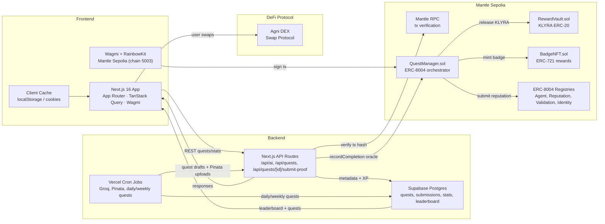

# Klyra Quest – DeFi Gamification on Mantle

Klyra Quest turns Mantle DeFi actions into tiered quests, verifies proofs through RPC, then distributes KLYRA rewards and badge NFTs via ERC‑8004 smart contracts. Built for the Mantle Hackathon.

---

## 📌 Project Summary

Klyra Quest is an on-chain quest platform on Mantle Sepolia that combines an AI quest generator with automatic proof verification. Users accept DeFi quests (swap on Agni DEX), submit a transaction hash as evidence, have it verified via RPC, and automatically receive KLYRA + badge NFTs from the QuestManager contract.


---

## 🧠 Problem & Why It Matters
- **Fragmented onboarding** – New Mantle users find it hard to discover meaningful DeFi actions beyond simple swaps.  
- **Web2 loyalty isn't portable** – Centralized XP/reward systems can't prove on-chain effort or transfer reputation.  
- **Need for transparent incentives** – Ecosystem partners want verifiable engagement metrics (XP, quests completed, tx volume) directly on Mantle.

Why Mantle? Low fees, fast finality, and ERC‑8004 agent tooling let us orchestrate verifiable quests with micro-rewards, perfect for incentivizing DeFi participation on Mantle.

---

## 💡 Solution Overview
Klyra Quest orchestrates ERC‑8004 agents, AI quest generation, and Mantle-native rewards to gamify DeFi actions.

**Key features**
- AI quest generator (Groq + Langchain)  
- Quest lifecycle (create → accept → submit proof → auto completion)  
- RPC verification to guard against fake proofs  
- KLYRA ERC-20 payout + BadgeNFT ERC-721 mint for every completion  
- Supabase-backed XP, leaderboard, and profile completion  
- Daily/weekly quests tailored to user wallet activity
- Agni DEX integration for swap quests

---

## 🏗️ Architecture Diagram



---

## 🛠 Tech Stack
| Layer | Tech |
| --- | --- |
| Frontend | Next.js 16 (App Router), React 19, Tailwind CSS 4, Wagmi + RainbowKit, TanStack Query |
| Backend | Next.js API Routes, Supabase JS, Groq, Pinata IPFS, Viem, Zod |
| Smart Contracts | Foundry, Solidity ^0.8.20, ERC‑8004 adapters, QuestManager, RewardVault, BadgeNFT, KlyraToken |
| Infra | Supabase (Postgres + functions), Mantle Sepolia Testnet, Groq API, Pinata, Vercel |

---

## 🔗 Mantle Integrations
- **Smart Contract Service (EVM)** – QuestManager (ERC‑8004 compatible) orchestrates quests; RewardVault holds KLYRA ERC‑20 balances; BadgeNFT mints ERC‑721 reward NFTs.  
- **JSON-RPC** – Backend verifies submitted transaction hashes via RPC before calling `recordCompletion`.  
- **Wallet support** – Wagmi/RainbowKit enforces Mantle Sepolia (chain id 5003) so users sign via JSON-RPC compatible wallets.  
- **DeFi Protocol** – Agni DEX integration for swap quests.

---

## 📂 Repository Structure
```
.
├── app/                          # Next.js 16 App Router
│   ├── api/                      # API Routes (quests, ai, cron)
│   ├── (with-sidebar)/           # Dashboard pages
│   ├── complete-profile/         # Onboarding flow
│   └── layout.tsx                # Root layout
├── components/                   # UI components (shadcn/ui)
├── contracts/                    # Foundry workspace (QuestManager, RewardVault, BadgeNFT)
│   ├── src/                      # Solidity sources
│   ├── script/                   # Deploy scripts (Deploy.s.sol)
│   ├── test/                     # Foundry tests
│   ├── lib/                      # git submodules (OpenZeppelin, forge-std)
│   ├── foundry.toml
│   └── README.md                 # Contract deployment guide
├── lib/                          # Shared libraries
│   ├── api-services/             # External services (Supabase, contracts, protocols)
│   ├── services/                 # Business logic (quest generation, verification, etc.)
│   ├── utils/                    # Utility functions
│   └── config/                   # Configuration (env, etc.)
├── public/                       # Static assets
├── components.json               # shadcn/ui config
├── next.config.ts                # Next.js configuration
├── package.json                  # Dependencies and scripts
├── vercel.json                   # Vercel configuration (cron jobs)
├── ENV_SETUP.md                  # Environment variables setup guide
├── DATABASE_SETUP.md             # Database setup guide
└── README.md                     # This file
```

---

## ⚙️ Installation & Setup

1. **Clone the repo**
   ```bash
   git clone <repository-url>
   cd klyra
   ```

2. **Contracts – build & deploy (Quest stack + ERC‑8004)**
   ```bash
   cd contracts
   forge install OpenZeppelin/openzeppelin-contracts
   forge install foundry-rs/forge-std
   forge build
   forge script script/Deploy.s.sol \
     --rpc-url https://rpc.sepolia.mantle.xyz \
     --private-key $PRIVATE_KEY \
     --broadcast
   ```
   See `contracts/README.md` for detailed deployment instructions.

3. **Environment variables**
   - Copy `.env.local.example` → `.env.local` (or see `ENV_SETUP.md`)
   - Fill in RPC URL, contract addresses, private keys, Supabase, Groq, Pinata credentials
   - Add `NEXT_PUBLIC_WALLETCONNECT_PROJECT_ID` for wallet connection

4. **Database setup**
   - Create Supabase project
   - Run SQL from `backend/database/schema.sql` (see `DATABASE_SETUP.md`)
   - Add Supabase URL and service role key to `.env.local`

5. **Install dependencies**
   ```bash
   npm install
   ```

6. **Run development server**
   ```bash
   npm run dev
   ```
   Frontend runs on `http://localhost:3000`. All API routes are served from the same Next.js server.

---

## 🔑 Environment Variables

See `ENV_SETUP.md` for complete environment variables guide. Key variables:

### Required
```bash
# Network
RPC_URL=https://rpc.sepolia.mantle.xyz

# Contract Addresses
QUEST_MANAGER_ADDRESS=0x...
REWARD_VAULT_ADDRESS=0x...
BADGE_NFT_ADDRESS=0x...
KLYRA_TOKEN_ADDRESS=0x...
REPUTATION_REGISTRY_ADDRESS=0x...
VALIDATION_REGISTRY_ADDRESS=0x...
AGENT_REGISTRY_ADAPTER_ADDRESS=0x...
COMPLETION_ORACLE=0x...

# Private Keys (backend only)
COMPLETION_ORACLE_PRIVATE_KEY=0x...
AGENT_CONTROLLER_PRIVATE_KEY=0x...

# External Services
GROQ_API_KEY=...
PINATA_JWT=...
SUPABASE_URL=...
SUPABASE_SERVICE_ROLE_KEY=...

# Frontend
NEXT_PUBLIC_WALLETCONNECT_PROJECT_ID=...
```

---

## 🧪 Testing

```bash
# Smart contracts
cd contracts
forge build
forge test

# Frontend/Backend (manual testing)
npm run dev
# Visit http://localhost:3000 and test flows manually
```

---

## 🎮 How to Use the App
1. **Connect wallet** via RainbowKit modal (MetaMask + other wallets supported).  
2. **Complete profile** (name + email) so daily/weekly quests can be generated.  
3. **Browse quests** under `/quests`.  
4. **Accept quest** on-chain via "Accept Quest" button.  
5. **Perform DeFi action** on Agni DEX (swap tokens).  
6. **Submit proof** (tx hash) via the quest detail page; backend verifies via RPC and triggers on-chain completion.  
7. **Claim rewards** – KLYRA + badge NFT minted automatically; XP/leaderboard update.  
8. **Track progress** on the profile page or leaderboard tab.

---

## 🌐 Deployment

- **Network**: Mantle Sepolia Testnet (Chain ID: 5003)
- **RPC**: https://rpc.sepolia.mantle.xyz
- **Explorer**: https://explorer.sepolia.mantle.xyz

### Deployed Contracts (Mantle Sepolia)
  | Component | Address |
  | --- | --- |
| IdentityRegistry | `0x5425Ada522Eb1aD89a12fbA4779F4Eaa471Ce34c` |
| ReputationRegistry | `0xe9D1BA495B29c07F6B0ff80381F0d7e66E00841d` |
| ValidationRegistry | `0xe3348290c1bAb7e6bFfc5374EEb127397B7f5Ea2` |
| AgentRegistryAdapter | `0xe34803D8CCfFC5c9B17c05fAA3Ee438A9Ca7Bf0b` |
| KlyraToken (ERC‑20) | `0xD94e2B8746a786e11Fd23aB22De9937BCB1e6EFB` |
| RewardVault | `0x9641e2F4fEfc43164B3C30edFfc51c3c942553E6` |
| BadgeNFT (ERC‑721) | `0x26613f151e019dcD6F2730045866D19D29Ec5598` |
| QuestManager | `0x3fEDf3864646b8fcBB79139e9527A4657209c1c2` |
| Completion Oracle | `0xCF448BF596D81cD7e893BC5976aB9b68609e13fF` |

### Frontend Deployment
- Deploy to Vercel: `vercel deploy`
- Cron jobs are configured in `vercel.json` for daily/weekly quest generation

---

## 🎯 Hackathon Submission

**Hackathon**: Mantle Hackathon  
**Track**: DeFi  
**Project**: Klyra Quest  
**Description**: Gamified DeFi quest platform that incentivizes user participation on Mantle through on-chain quests, AI-generated challenges, and NFT rewards.

**Key Highlights**:
- Full-stack Next.js application with smart contracts
- ERC-8004 agent orchestration
- AI-powered quest generation using Groq
- Integration with Agni DEX for swap quests
- On-chain verification and reward distribution
- Daily/weekly quest system for user retention

---

## 🗺 Roadmap 
- **Q1 2026** – Expand quest types (liquidity, staking) and integrate more Mantle DeFi protocols.  
- **Q2 2026** – KLYRA staking & DAO-style quest governance (voting on quest budgets, reward multipliers).  
- **Q3 2026** – Mobile app + push notifications via WalletConnect; richer quest analytics in dashboards.  
- **Q4 2026** – Protocol marketplace so partners can publish quests, attach budgets, and track ROI.  
- **Always-on** – Observability (Supabase CDC → Grafana) plus RPC health monitors to ensure verification SLAs.

---

## 👥 Team
| Member | Role | Contact |
| --- | --- | --- |
| _Pradipa Naqa_ | FullStack | [Telegram](https://t.me/prapnaqa)
---

## 🤝 License
Copyright Klyra Quest team. All rights reserved.

---

## 📮 Contact
- [GitHub](https://github.com/RowNode/klyra)
- [Website](https://klyra-theta.vercel.app/)
    